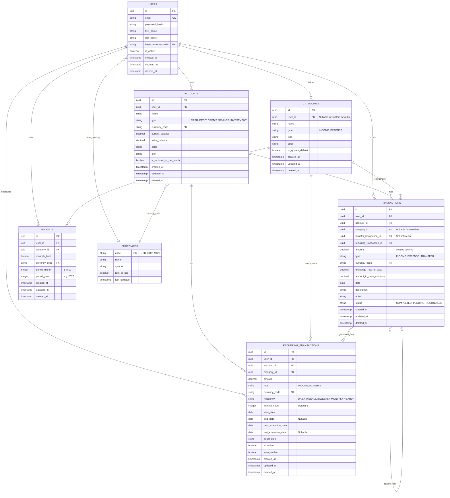
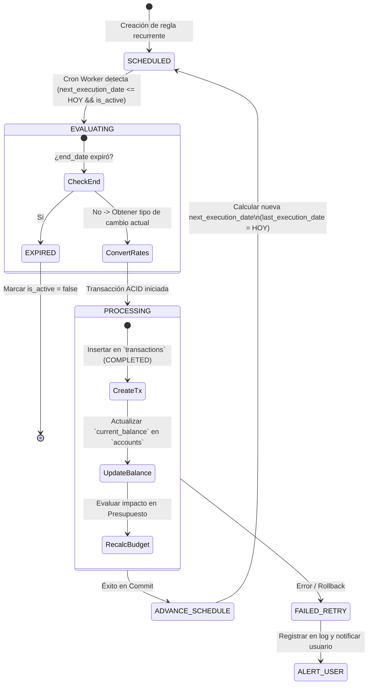
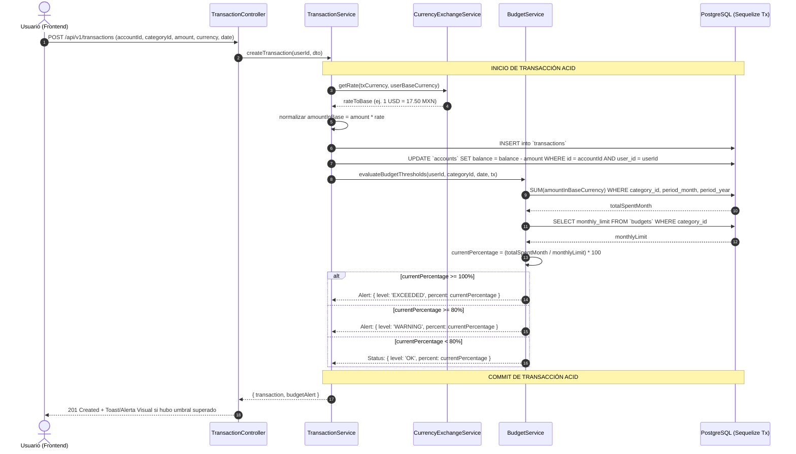

# 🏛️ Documento de Planeación Técnica & Arquitectura de Software
## Sistema de Gestión de Finanzas Personales Multi-Tenant (Modular Monolith)

---

## 1. Visión General, Stack Tecnológico y Arquitectura del Sistema

### 1.1. Filosofía y Principios de Diseño
El sistema está diseñado bajo el patrón **Modular Monolith** (Monolito Modular) con **Clean Architecture / Layered Architecture**. Esta decisión técnica optimiza los costos operativos, simplifica el despliegue (CI/CD) y maximiza la velocidad de desarrollo para baja/mediana concurrencia, manteniendo al mismo tiempo una estricta separación de dominios (Cuentas, Transacciones, Presupuestos, Divisas, Reportes) que permitirá desacoplar módulos a microservicios en el futuro si la escala lo demanda.

```
┌────────────────────────────────────────────────────────────────────────┐
│                              FRONTEND                                  │
│             Next.js 15+ (App Router) / React 19 / TypeScript            │
│       Tailwind CSS v4 + Radix UI Primitives + Atomic Design System     │
└───────────────────────────────────┬────────────────────────────────────┘
                                    │ HTTPS / REST API / JSON
                                    │ (HttpOnly Secure Cookies + CSRF)
┌───────────────────────────────────▼────────────────────────────────────┐
│                        BACKEND API (Node.js + Express/TS)              │
│ ┌────────────────────────────────────────────────────────────────────┐ │
│ │ Global Middlewares: Helmet, CORS, RateLimiter, AuthGuard, ErrorHdl  │ │
│ └─────────────────────────────────┬──────────────────────────────────┘ │
│ ┌─────────────────────────────────▼──────────────────────────────────┐ │
│ │ Presentation Layer: Controllers + DTO Validation (Zod)             │ │
│ └─────────────────────────────────┬──────────────────────────────────┘ │
│ ┌─────────────────────────────────▼──────────────────────────────────┐ │
│ │ Domain & Application Layer: Services + Business Logic + Events     │ │
│ └─────────────────────────────────┬──────────────────────────────────┘ │
│ ┌─────────────────────────────────▼──────────────────────────────────┐ │
│ │ Data Access Layer: Repositories + Sequelize ORM (Paranoid/UUIDv4) │ │
│ └─────────────────────────────────┬──────────────────────────────────┘ │
│ ┌─────────────────────────────────▼──────────────────────────────────┐ │
│ │ Background Workers: Node-Cron / BullMQ (Recurring Transactions)    │ │
│ └────────────────────────────────────────────────────────────────────┘ │
└───────────────────────────────────┬────────────────────────────────────┘
                                    │ TCP / SSL (Pool connection)
┌───────────────────────────────────▼────────────────────────────────────┐
│                  DATABASE: PostgreSQL 16+ (Relacional)                 │
│         ACID Transactions, UUIDv4 PKs, Logical Isolation (user_id)     │
└────────────────────────────────────────────────────────────────────────┘
```

---

### 1.2. Justificación del Stack Tecnológico

| Capa / Componente | Tecnología Seleccionada | Justificación Técnica |
| :--- | :--- | :--- |
| **Backend Core** | **Node.js (LTS v22) + Express + TypeScript** | Tipado estricto de punto a punto, robustez en el ecosistema, bajo consumo de recursos en entornos contenerizados y excelente soporte de I/O asíncrono. |
| **ORM / Data Access** | **Sequelize v6/v7 (TypeScript)** | Soporte nativo para PostgreSQL, control declarativo de migraciones/seeders, soporte de transacciones ACID administradas, borrado lógico (*paranoid*) y tipado de modelos (`InferAttributes`). |
| **Base de Datos** | **PostgreSQL 16** | Consistencia relacional estricta, soporte nativo de tipos `UUID`, precisión decimal arbitraria (`NUMERIC`/`DECIMAL`) esencial para operaciones contables, e índices B-Tree/GIN de alto rendimiento. |
| **Frontend Core** | **Next.js 15+ / React 19 + TypeScript** | Renderizado híbrido (SSR para vistas públicas, Client Components optimizados para interactividad contable), Server Actions para mutaciones seguras y App Router para modularidad. |
| **Estilos & UI Kit** | **Tailwind CSS v4 + Radix UI + Lucide React** | Sistema de diseño basado en utilidades de alto rendimiento, accesibilidad nativa (WAI-ARIA) y consistencia en la implementación del patrón **Atomic Design**. |
| **Visualización de Datos** | **Recharts** | Biblioteca declarativa basada en SVG, altamente reactiva, responsiva y adaptable a la paleta de colores del sistema. |
| **Generación de Reportes** | **`@react-pdf/renderer` (o Puppeteer según caso)** | Renderizado determinista de documentos PDF estilizados utilizando componentes reactivos con soporte para paginación dinámica y tipografía vectorial. *(Ver comparativa en sección 1.4).* |
| **Background Processing** | **Node-Cron + BullMQ (Redis opcional)** | Planificador liviano para el procesamiento periódico de transacciones recurrentes y cálculo de estados presupuestarios. |

---

### 1.3. Arquitectura en Capas del Backend (Clean Layered Pattern)

El backend implementa un aislamiento estricto de responsabilidades:

1. **DTOs & Validation Layer (`/dtos`):** Esquemas de validación en tiempo de ejecución con **Zod**. Sanitizan y tipan la entrada antes de llegar al controlador.
2. **Controller Layer (`/controllers`):** Reciben las peticiones HTTP, extraen el contexto del usuario autenticado (`req.user.id`), delegan la lógica a los servicios y retornan respuestas HTTP estandarizadas (`{ success, data, message, meta }`).
3. **Service Layer (`/services`):** Contiene la lógica de negocio pura (conversiones de divisas, normalización de saldos, validación de techos presupuestarios, reglas contables). **Ningún servicio recibe objetos `req` o `res` de Express.**
4. **Repository / Data Access Layer (`/repositories`):** Encapsula todas las consultas de Sequelize. **Aplica mandatoriamente la cláusula `where: { user_id }` en cada operación**, garantizando el aislamiento lógico de datos (*Data Isolation*).
5. **Middlewares (`/middlewares`):**
   - `authGuard`: Valida el JWT de la cookie `HttpOnly` y adjunta la sesión decodificada a `req.user`.
   - `rateLimiter`: Limita solicitudes por IP/usuario para prevenir ataques de fuerza bruta o DoS.
   - `csrfProtection`: Valida tokens anti-CSRF en mutaciones (`POST`, `PUT`, `DELETE`, `PATCH`).
   - `errorHandler`: Captura excepciones no controladas, oculta trazas internas en producción y retorna códigos HTTP semánticos (400, 401, 403, 404, 422, 500).

```
src/
├── config/             # Variables de entorno, db connection, logger
├── constants/          # Enums de divisas, categorías por defecto, códigos de error
├── database/
│   ├── migrations/     # Migraciones Sequelize cronológicas
│   ├── seeders/        # Categorías y divisas base
│   └── index.ts        # Inicialización y asociación de modelos
├── modules/            # Módulos de dominio vertical (Monolito Modular)
│   ├── auth/           # Login, Register, Tokens, Hasher
│   ├── accounts/       # Cuentas bancarias, efectivo, tarjetas
│   ├── transactions/   # Ingresos, egresos, transferencias
│   ├── recurring/      # Motor de recurrencias y workers
│   ├── budgets/        # Presupuestos, alertas de umbrales
│   ├── currencies/     # Tasas de cambio, normalización monetaria
│   └── reports/        # Generador de estadísticas y PDFs
├── shared/             # Middlewares globales, DTOs compartidos, utilidades
└── server.ts           # Entrypoint de la aplicación
```

---

### 1.4. Análisis Comparativo y Selección de Librería para Generación de PDFs

Para la exportación de reportes financieros mensuales y anuales estilizados, evaluamos tres alternativas:

```
┌─────────────────────────────────────────────────────────────────────────────┐
│                          EVALUACIÓN DE MOTORES PDF                          │
├───────────────────┬──────────────────────────┬──────────────────────────────┤
│ Librería          │ Ventajas                 │ Desventajas / Riesgos        │
├───────────────────┼──────────────────────────┼──────────────────────────────┤
│ @react-pdf/       │ • Componentes React      │ • Soporte limitado de CSS    │
│ renderer          │ • Ejecución nativa en    │   avanzado (flexbox básico)  │
│ (RECOMENDADA)     │   Node.js sin headless   │ • Requiere componentes       │
│                   │ • Bajo consumo de RAM    │   dedicados de PDF           │
│                   │ • Generación vectorial   │                              │
├───────────────────┼──────────────────────────┼──────────────────────────────┤
│ Puppeteer /       │ • Soporte de HTML/CSS    │ • Alto consumo de CPU y RAM  │
│ Playwright        │   completo y Tailwind    │   (inicia Chromium)          │
│                   │ • Gráficos SVG complejos │ • Riesgo de memory leaks en  │
│                   │   idénticos a la web     │   concurrencia               │
├───────────────────┼──────────────────────────┼──────────────────────────────┤
│ PDFKit            │ • Ultraligero y rápido   │ • Código imperativo tedioso  │
│                   │ • Cero dependencias DOM  │ • Difícil mantenimiento de   │
│                   │                          │   diseños visuales complejos │
└───────────────────┴──────────────────────────┴──────────────────────────────┘
```

> [!TIP]
> **Decisión de Arquitectura:**
> Se selecciona **`@react-pdf/renderer`** en el **backend** para la generación de reportes estándar debido a su equilibrio óptimo entre bajo consumo de recursos (evita desplegar instancias pesadas de Chromium) y renderizado profesional de tablas contables paginadas y balances. Para gráficos de distribución vectorial en el PDF, se pre-renderizan como SVGs/imágenes base64 en el servicio antes de inyectarse en el documento.

---

## 2. Modelo de Datos y Esquemas (PostgreSQL + Sequelize)

### 2.1. Consideraciones Financieras y de Integridad
- **Precisión Monetaria:** Se utiliza estrictamente `DECIMAL(14, 2)` (o `NUMERIC(14, 2)`) para evitar los errores de redondeo de punto flotante binario (`IEEE 754`).
- **Claves Primarias:** Universales `UUIDv4` (`gen_random_uuid()` o `uuid_generate_v4()`) para evitar enumeración y facilitar sincronización distribuida.
- **Borrado Lógico (*Soft Delete*):** Activación de `paranoid: true` (`deleted_at TIMESTAMP NULL`) en todas las tablas transaccionales y de configuración para trazabilidad contable y auditoría.
- **Índices Compuestos:** Optimizados para filtros comunes: `(user_id, date DESC)`, `(user_id, category_id)`, `(user_id, account_id)`.

---

### 2.2. Diagrama Entidad-Relación (ERD)



---

### 2.3. Definición de Modelos Sequelize en TypeScript (Ejemplos Core)

#### 1. Modelo `Transaction` (`src/modules/transactions/models/transaction.model.ts`)

```typescript
import {
  Table,
  Column,
  Model,
  DataType,
  PrimaryKey,
  Default,
  ForeignKey,
  BelongsTo,
  Index,
  AllowNull,
  CreatedAt,
  UpdatedAt,
  DeletedAt,
} from 'sequelize-typescript';
import { User } from '../../auth/models/user.model';
import { Account } from '../../accounts/models/account.model';
import { Category } from '../../categories/models/category.model';
import { RecurringTransaction } from '../../recurring/models/recurring-transaction.model';

export enum TransactionType {
  INCOME = 'INCOME',
  EXPENSE = 'EXPENSE',
  TRANSFER = 'TRANSFER',
}

export enum TransactionStatus {
  COMPLETED = 'COMPLETED',
  PENDING = 'PENDING',
  RECONCILED = 'RECONCILED',
}

@Table({
  tableName: 'transactions',
  timestamps: true,
  paranoid: true,
  underscored: true,
})
export class Transaction extends Model {
  @PrimaryKey
  @Default(DataType.UUIDV4)
  @Column(DataType.UUID)
  id!: string;

  @ForeignKey(() => User)
  @Index('idx_transactions_user_id')
  @AllowNull(false)
  @Column(DataType.UUID)
  userId!: string;

  @ForeignKey(() => Account)
  @Index('idx_transactions_account_id')
  @AllowNull(false)
  @Column(DataType.UUID)
  accountId!: string;

  @ForeignKey(() => Category)
  @Index('idx_transactions_category_id')
  @AllowNull(true) // Nullable en transferencias entre cuentas propias
  @Column(DataType.UUID)
  categoryId!: string | null;

  @ForeignKey(() => Transaction)
  @AllowNull(true)
  @Column(DataType.UUID)
  transferTransactionId!: string | null;

  @ForeignKey(() => RecurringTransaction)
  @AllowNull(true)
  @Column(DataType.UUID)
  recurringTransactionId!: string | null;

  @AllowNull(false)
  @Column({
    type: DataType.DECIMAL(14, 2),
    validate: { min: 0.01 },
  })
  amount!: number;

  @AllowNull(false)
  @Column(DataType.ENUM(...Object.values(TransactionType)))
  type!: TransactionType;

  @AllowNull(false)
  @Column(DataType.STRING(3))
  currencyCode!: string;

  @AllowNull(false)
  @Column(DataType.DECIMAL(18, 6))
  exchangeRateToBase!: number;

  @AllowNull(false)
  @Column(DataType.DECIMAL(14, 2))
  amountInBaseCurrency!: number;

  @Index('idx_transactions_user_date')
  @AllowNull(false)
  @Column(DataType.DATEONLY)
  date!: string;

  @AllowNull(false)
  @Column(DataType.STRING(255))
  description!: string;

  @AllowNull(true)
  @Column(DataType.TEXT)
  notes!: string | null;

  @Default(TransactionStatus.COMPLETED)
  @AllowNull(false)
  @Column(DataType.ENUM(...Object.values(TransactionStatus)))
  status!: TransactionStatus;

  @BelongsTo(() => User)
  user!: User;

  @BelongsTo(() => Account)
  account!: Account;

  @BelongsTo(() => Category)
  category!: Category;

  @BelongsTo(() => Transaction, { foreignKey: 'transferTransactionId', as: 'transferPair' })
  transferPair!: Transaction;

  @BelongsTo(() => RecurringTransaction)
  recurringSource!: RecurringTransaction;

  @CreatedAt
  createdAt!: Date;

  @UpdatedAt
  updatedAt!: Date;

  @DeletedAt
  deletedAt!: Date | null;
}
```

---

#### 2. Modelo `RecurringTransaction` (`src/modules/recurring/models/recurring-transaction.model.ts`)

```typescript
import {
  Table,
  Column,
  Model,
  DataType,
  PrimaryKey,
  Default,
  ForeignKey,
  BelongsTo,
  Index,
  AllowNull,
  CreatedAt,
  UpdatedAt,
  DeletedAt,
} from 'sequelize-typescript';
import { User } from '../../auth/models/user.model';
import { Account } from '../../accounts/models/account.model';
import { Category } from '../../categories/models/category.model';
import { TransactionType } from '../../transactions/models/transaction.model';

export enum RecurrenceFrequency {
  DAILY = 'DAILY',
  WEEKLY = 'WEEKLY',
  BIWEEKLY = 'BIWEEKLY',
  MONTHLY = 'MONTHLY',
  YEARLY = 'YEARLY',
}

@Table({
  tableName: 'recurring_transactions',
  timestamps: true,
  paranoid: true,
  underscored: true,
})
export class RecurringTransaction extends Model {
  @PrimaryKey
  @Default(DataType.UUIDV4)
  @Column(DataType.UUID)
  id!: string;

  @ForeignKey(() => User)
  @Index('idx_recurring_user_id')
  @AllowNull(false)
  @Column(DataType.UUID)
  userId!: string;

  @ForeignKey(() => Account)
  @AllowNull(false)
  @Column(DataType.UUID)
  accountId!: string;

  @ForeignKey(() => Category)
  @AllowNull(false)
  @Column(DataType.UUID)
  categoryId!: string;

  @AllowNull(false)
  @Column({
    type: DataType.DECIMAL(14, 2),
    validate: { min: 0.01 },
  })
  amount!: number;

  @AllowNull(false)
  @Column(DataType.ENUM(TransactionType.INCOME, TransactionType.EXPENSE))
  type!: TransactionType.INCOME | TransactionType.EXPENSE;

  @AllowNull(false)
  @Column(DataType.STRING(3))
  currencyCode!: string;

  @AllowNull(false)
  @Column(DataType.ENUM(...Object.values(RecurrenceFrequency)))
  frequency!: RecurrenceFrequency;

  @Default(1)
  @AllowNull(false)
  @Column(DataType.INTEGER)
  intervalCount!: number;

  @AllowNull(false)
  @Column(DataType.DATEONLY)
  startDate!: string;

  @AllowNull(true)
  @Column(DataType.DATEONLY)
  endDate!: string | null;

  @Index('idx_recurring_next_exec')
  @AllowNull(false)
  @Column(DataType.DATEONLY)
  nextExecutionDate!: string;

  @AllowNull(true)
  @Column(DataType.DATEONLY)
  lastExecutionDate!: string | null;

  @AllowNull(false)
  @Column(DataType.STRING(255))
  description!: string;

  @Default(true)
  @AllowNull(false)
  @Column(DataType.BOOLEAN)
  isActive!: boolean;

  @Default(true)
  @AllowNull(false)
  @Column(DataType.BOOLEAN)
  autoConfirm!: boolean;

  @BelongsTo(() => User)
  user!: User;

  @BelongsTo(() => Account)
  account!: Account;

  @BelongsTo(() => Category)
  category!: Category;

  @CreatedAt
  createdAt!: Date;

  @UpdatedAt
  updatedAt!: Date;

  @DeletedAt
  deletedAt!: Date | null;
}
```

---

### 2.4. Ejemplo de Migración Sequelize (`src/database/migrations/20260817000003-create-transactions.ts`)

```typescript
import { QueryInterface, DataTypes } from 'sequelize';

export async function up(queryInterface: QueryInterface): Promise<void> {
  // Asegurar extensión pgcrypto o uuid-ossp en PostgreSQL
  await queryInterface.sequelize.query('CREATE EXTENSION IF NOT EXISTS "uuid-ossp";');

  await queryInterface.createTable('transactions', {
    id: {
      type: DataTypes.UUID,
      defaultValue: DataTypes.UUIDV4,
      primaryKey: true,
      allowNull: false,
    },
    user_id: {
      type: DataTypes.UUID,
      allowNull: false,
      references: { model: 'users', key: 'id' },
      onUpdate: 'CASCADE',
      onDelete: 'CASCADE',
    },
    account_id: {
      type: DataTypes.UUID,
      allowNull: false,
      references: { model: 'accounts', key: 'id' },
      onUpdate: 'CASCADE',
      onDelete: 'RESTRICT',
    },
    category_id: {
      type: DataTypes.UUID,
      allowNull: true,
      references: { model: 'categories', key: 'id' },
      onUpdate: 'CASCADE',
      onDelete: 'SET NULL',
    },
    transfer_transaction_id: {
      type: DataTypes.UUID,
      allowNull: true,
      references: { model: 'transactions', key: 'id' },
      onUpdate: 'CASCADE',
      onDelete: 'SET NULL',
    },
    recurring_transaction_id: {
      type: DataTypes.UUID,
      allowNull: true,
      references: { model: 'recurring_transactions', key: 'id' },
      onUpdate: 'CASCADE',
      onDelete: 'SET NULL',
    },
    amount: {
      type: DataTypes.DECIMAL(14, 2),
      allowNull: false,
    },
    type: {
      type: DataTypes.ENUM('INCOME', 'EXPENSE', 'TRANSFER'),
      allowNull: false,
    },
    currency_code: {
      type: DataTypes.STRING(3),
      allowNull: false,
      references: { model: 'currencies', key: 'code' },
    },
    exchange_rate_to_base: {
      type: DataTypes.DECIMAL(18, 6),
      allowNull: false,
      defaultValue: 1.0,
    },
    amount_in_base_currency: {
      type: DataTypes.DECIMAL(14, 2),
      allowNull: false,
    },
    date: {
      type: DataTypes.DATEONLY,
      allowNull: false,
    },
    description: {
      type: DataTypes.STRING(255),
      allowNull: false,
    },
    notes: {
      type: DataTypes.TEXT,
      allowNull: true,
    },
    status: {
      type: DataTypes.ENUM('COMPLETED', 'PENDING', 'RECONCILED'),
      allowNull: false,
      defaultValue: 'COMPLETED',
    },
    created_at: {
      type: DataTypes.DATE,
      allowNull: false,
    },
    updated_at: {
      type: DataTypes.DATE,
      allowNull: false,
    },
    deleted_at: {
      type: DataTypes.DATE,
      allowNull: true,
    },
  });

  // Índices para optimización de queries analíticas
  await queryInterface.addIndex('transactions', ['user_id', 'date'], {
    name: 'idx_transactions_user_date',
  });
  await queryInterface.addIndex('transactions', ['user_id', 'category_id'], {
    name: 'idx_transactions_user_category',
  });
  await queryInterface.addIndex('transactions', ['account_id'], {
    name: 'idx_transactions_account',
  });
}

export async function down(queryInterface: QueryInterface): Promise<void> {
  await queryInterface.dropTable('transactions');
}
```

---

## 3. Máquinas de Estados y Flujos de Trabajo

### 3.1. Ciclo de Vida y Procesamiento de Transacciones Recurrentes

Las transacciones periódicas (sueldos, rentas, suscripciones SaaS) operan mediante un ciclo continuo de planificación, validación e instanciación en el libro contable de transacciones reales.



---

### 3.2. Flujo de Registro de Transacción y Verificación de Presupuestos en Tiempo Real

Cada vez que se registra un gasto (`EXPENSE`), el sistema ejecuta un flujo atómico que garantiza consistencia de saldo y alerta inmediata de presupuesto:



---

## 4. Algoritmos y Lógica Clave de Negocio

### 4.1. Algoritmo de Normalización Monetaria y Consolidación Multidivisa

Para generar métricas globales (Patrimonio Neto, Gastos Totales del Mes, Balance por Categoría) cuando el usuario tiene cuentas o transacciones en diferentes divisas (USD, EUR, MXN, JPY), todo se normaliza a la **Divisa Base del Usuario** mediante tasas triangulares referenciadas a USD.

$$\text{Tasa}(C_{\text{origen}} \to C_{\text{destino}}) = \frac{\text{RateUSD}(C_{\text{destino}})}{\text{RateUSD}(C_{\text{origen}})}$$

$$\text{Monto en Base} = \text{Monto Original} \times \text{Tasa}(C_{\text{transacción}} \to C_{\text{base\_usuario}})$$

#### Implementación del Servicio de Normalización (`src/modules/currencies/services/currency.service.ts`):

```typescript
import Decimal from 'decimal.js';

export interface ExchangeRateMap {
  [currencyCode: string]: number; // Tasa respecto a 1 USD (ej: USD=1, EUR=0.92, MXN=17.50)
}

export class CurrencyService {
  /**
   * Convierte un monto de cualquier divisa a la divisa base del usuario con precisión matemática.
   */
  public convertAmount(
    amount: number | string,
    fromCurrency: string,
    toCurrency: string,
    rates: ExchangeRateMap,
  ): { convertedAmount: number; exchangeRate: number } {
    if (fromCurrency === toCurrency) {
      return {
        convertedAmount: new Decimal(amount).toDecimalPlaces(2, Decimal.ROUND_HALF_UP).toNumber(),
        exchangeRate: 1.0,
      };
    }

    const rateFromUSD = rates[fromCurrency];
    const rateToUSD = rates[toCurrency];

    if (!rateFromUSD || !rateToUSD) {
      throw new Error(`Tasa de cambio no disponible para el par ${fromCurrency}/${toCurrency}`);
    }

    // Tasa cruzada: (1 / rateFromUSD) * rateToUSD
    const rateFrom = new Decimal(rateFromUSD);
    const rateTo = new Decimal(rateToUSD);
    const crossRate = rateTo.dividedBy(rateFrom);

    const converted = new Decimal(amount).times(crossRate);

    return {
      convertedAmount: converted.toDecimalPlaces(2, Decimal.ROUND_HALF_UP).toNumber(),
      exchangeRate: crossRate.toDecimalPlaces(6, Decimal.ROUND_HALF_UP).toNumber(),
    };
  }
}
```

---

### 4.2. Motor de Evaluación Presupuestaria y Alertas de Umbrales

El motor calcula la ejecución presupuestaria en tiempo real comparando el límite asignado con el gasto mensual consolidado en la divisa base.

#### Algoritmo de Presupuestos (`src/modules/budgets/services/budget.service.ts`):

```typescript
import Decimal from 'decimal.js';
import { Transaction, TransactionType, TransactionStatus } from '../../transactions/models/transaction.model';
import { Budget } from '../models/budget.model';
import { Op, Transaction as SequelizeTransaction } from 'sequelize';

export interface BudgetEvaluationResult {
  hasBudget: boolean;
  monthlyLimit: number;
  totalSpent: number;
  remainingAmount: number;
  executionPercentage: number;
  alertLevel: 'OK' | 'WARNING_80' | 'EXCEEDED_100';
  message: string;
}

export class BudgetService {
  public async evaluateCategoryBudget(
    userId: string,
    categoryId: string,
    dateString: string,
    dbTransaction?: SequelizeTransaction,
  ): Promise<BudgetEvaluationResult> {
    const date = new Date(dateString);
    const month = date.getUTCMonth() + 1; // 1-12
    const year = date.getUTCFullYear();

    // 1. Obtener presupuesto configurado para el mes
    const budget = await Budget.findOne({
      where: { userId, categoryId, periodMonth: month, periodYear: year },
      transaction: dbTransaction,
    });

    if (!budget) {
      return {
        hasBudget: false,
        monthlyLimit: 0,
        totalSpent: 0,
        remainingAmount: 0,
        executionPercentage: 0,
        alertLevel: 'OK',
        message: 'Sin presupuesto asignado para esta categoría.',
      };
    }

    // 2. Rango de fechas del mes (UTC)
    const startOfMonth = `${year}-${String(month).padStart(2, '0')}-01`;
    const lastDay = new Date(year, month, 0).getDate();
    const endOfMonth = `${year}-${String(month).padStart(2, '0')}-${String(lastDay).padStart(2, '0')}`;

    // 3. Sumarizar gastos completados en divisa base
    const totalSpentResult = (await Transaction.sum('amountInBaseCurrency', {
      where: {
        userId,
        categoryId,
        type: TransactionType.EXPENSE,
        status: TransactionStatus.COMPLETED,
        date: { [Op.between]: [startOfMonth, endOfMonth] },
      },
      transaction: dbTransaction,
    })) || 0;

    const limit = new Decimal(budget.monthlyLimit);
    const spent = new Decimal(totalSpentResult);
    const remaining = limit.minus(spent);
    const percentage = limit.isZero() ? new Decimal(0) : spent.dividedBy(limit).times(100);

    const execPercent = percentage.toDecimalPlaces(2, Decimal.ROUND_HALF_UP).toNumber();

    let alertLevel: 'OK' | 'WARNING_80' | 'EXCEEDED_100' = 'OK';
    let message = 'Presupuesto en estado saludable.';

    if (execPercent >= 100) {
      alertLevel = 'EXCEEDED_100';
      message = `¡Alerta crítica! Has superado el 100% de tu presupuesto en esta categoría (${execPercent}% consumido).`;
    } else if (execPercent >= 80) {
      alertLevel = 'WARNING_80';
      message = `Precaución: Has alcanzado el ${execPercent}% de tu presupuesto mensual.`;
    }

    return {
      hasBudget: true,
      monthlyLimit: limit.toNumber(),
      totalSpent: spent.toNumber(),
      remainingAmount: remaining.toNumber(),
      executionPercentage: execPercent,
      alertLevel,
      message,
    };
  }
}
```

---

### 4.3. Worker de Procesamiento Periódico de Recurrencias (Cron Job Idempotente)

```typescript
import cron from 'node-cron';
import { Op } from 'sequelize';
import { sequelize } from '../../../database';
import { RecurringTransaction, RecurrenceFrequency } from '../models/recurring-transaction.model';
import { Transaction, TransactionStatus } from '../../transactions/models/transaction.model';
import { Account } from '../../accounts/models/account.model';
import { CurrencyService } from '../../currencies/services/currency.service';
import { User } from '../../auth/models/user.model';

export class RecurringTransactionsWorker {
  private isRunning = false;

  public startSchedule(): void {
    // Se ejecuta todos los días a las 00:05 UTC
    cron.schedule('5 0 * * *', async () => {
      if (this.isRunning) return;
      this.isRunning = true;
      console.log('⏰ [Worker] Iniciando procesamiento de transacciones recurrentes...');
      try {
        await this.processPendingRecurring();
      } catch (err) {
        console.error('❌ [Worker Error]:', err);
      } finally {
        this.isRunning = false;
      }
    });
  }

  public async processPendingRecurring(): Promise<void> {
    const today = new Date().toISOString().split('T')[0];

    // Buscar transacciones activas listas para ejecutar
    const recurrings = await RecurringTransaction.findAll({
      where: {
        isActive: true,
        nextExecutionDate: { [Op.lte]: today },
        [Op.or]: [
          { endDate: null },
          { endDate: { [Op.gte]: today } },
        ],
      },
      include: [{ model: User, attributes: ['id', 'baseCurrencyCode'] }],
    });

    for (const item of recurrings) {
      const tx = await sequelize.transaction();
      try {
        // 1. Obtener cuenta asociada
        const account = await Account.findByPk(item.accountId, { transaction: tx });
        if (!account) throw new Error(`Cuenta ${item.accountId} no encontrada`);

        // 2. Calcular tipo de cambio actual a base
        const currencyService = new CurrencyService();
        // rates obtenidos de cache/BD
        const rateToBase = 1.0; // Obtener de ExchangeRateService
        const amountInBase = Number(item.amount) * rateToBase;

        // 3. Crear registro en `transactions`
        await Transaction.create(
          {
            userId: item.userId,
            accountId: item.accountId,
            categoryId: item.categoryId,
            recurringTransactionId: item.id,
            amount: item.amount,
            type: item.type,
            currencyCode: item.currencyCode,
            exchangeRateToBase: rateToBase,
            amountInBaseCurrency: amountInBase,
            date: item.nextExecutionDate,
            description: `[Recurrente] ${item.description}`,
            status: TransactionStatus.COMPLETED,
          },
          { transaction: tx },
        );

        // 4. Actualizar balance de cuenta
        const delta = item.type === 'INCOME' ? Number(item.amount) : -Number(item.amount);
        account.currentBalance = Number(account.currentBalance) + delta;
        await account.save({ transaction: tx });

        // 5. Calcular siguiente fecha de ejecución
        const nextDate = this.calculateNextDate(item.nextExecutionDate, item.frequency, item.intervalCount);
        item.lastExecutionDate = item.nextExecutionDate;
        item.nextExecutionDate = nextDate;

        // Si se sobrepasó endDate, desactivar
        if (item.endDate && nextDate > item.endDate) {
          item.isActive = false;
        }

        await item.save({ transaction: tx });
        await tx.commit();
      } catch (error) {
        await tx.rollback();
        console.error(`Error procesando recurrencia ${item.id}:`, error);
      }
    }
  }

  private calculateNextDate(currentDateStr: string, freq: RecurrenceFrequency, interval: number): string {
    const d = new Date(currentDateStr);
    switch (freq) {
      case RecurrenceFrequency.DAILY:
        d.setUTCDate(d.getUTCDate() + interval);
        break;
      case RecurrenceFrequency.WEEKLY:
        d.setUTCDate(d.getUTCDate() + 7 * interval);
        break;
      case RecurrenceFrequency.BIWEEKLY:
        d.setUTCDate(d.getUTCDate() + 14 * interval);
        break;
      case RecurrenceFrequency.MONTHLY:
        d.setUTCMonth(d.getUTCMonth() + interval);
        break;
      case RecurrenceFrequency.YEARLY:
        d.setUTCFullYear(d.getUTCFullYear() + interval);
        break;
    }
    return d.toISOString().split('T')[0];
  }
}
```

---

## 5. Arquitectura Frontend: Sistema de Diseño con Atomic Design

El frontend implementa el patrón **Atomic Design** para garantizar componentes reutilizables, accesibles y fuertemente desacoplados.

```
src/
├── app/                        # Next.js App Router (Rutas y Server Pages)
│   ├── (auth)/login/page.tsx
│   ├── (dashboard)/
│   │   ├── page.tsx            # DashboardPage
│   │   ├── transactions/page.tsx
│   │   ├── budgets/page.tsx
│   │   ├── reports/page.tsx
│   │   └── settings/page.tsx
│   └── layout.tsx
├── components/
│   ├── atoms/                  # Componentes indivisibles
│   │   ├── Button/
│   │   ├── InputCurrency/
│   │   ├── SelectCategory/
│   │   ├── BadgeStatus/
│   │   ├── ProgressBar/
│   │   ├── CurrencySymbol/
│   │   └── Icon/
│   ├── molecules/              # Combinaciones funcionales simples
│   │   ├── FormField/
│   │   ├── AccountCard/
│   │   ├── BudgetProgressBar/  # Variación semántica (Verde / Amarillo 80% / Rojo 100%)
│   │   ├── CurrencyConverterInput/
│   │   └── DateRangePicker/
│   ├── organisms/              # Estructuras complejas e interactivas
│   │   ├── TransactionForm/
│   │   ├── TransactionsTable/  # Con filtros de búsqueda, divisa y ordenamiento
│   │   ├── BudgetOverviewCard/
│   │   ├── ExpenseDistributionChart/
│   │   ├── Navbar/
│   │   └── PdfExportModal/
│   └── templates/              # Layouts estructurales con slots/props
│       ├── MainLayout/
│       ├── DashboardTemplate/
│       ├── TransactionsTemplate/
│       ├── BudgetsTemplate/
│       └── ReportsTemplate/
├── hooks/                      # Custom React Hooks (useTransactions, useBudgets, etc.)
├── services/                   # Clientes HTTP (Axios / Fetch con interceptores)
└── types/                      # Interfaces TypeScript compartidas
```

---

### 5.1. Detalle y Responsabilidad de Componentes

#### 🟢 Átomos (`/components/atoms`)

| Átomo | Props Principales | Responsabilidad & Comportamiento |
| :--- | :--- | :--- |
| `Button` | `variant: 'primary' \| 'secondary' \| 'danger' \| 'ghost'`, `size`, `isLoading`, `leftIcon`, `disabled` | Botón estándar con soporte de estados de carga accesibles y estilos consistentes. |
| `InputCurrency` | `value: number`, `currencyCode: string`, `onChange: (val: number) => void`, `precision?: number` | Input formateado con máscara monetaria (ej. `$ 1,250.50`), bloquea caracteres no numéricos. |
| `SelectCategory`| `categories: Category[]`, `value: string`, `onSelect`, `categoryType: 'INCOME' \| 'EXPENSE'` | Selector dropdown estilizado con preview de icono y color de cada categoría. |
| `BadgeStatus` | `status: 'COMPLETED' \| 'PENDING' \| 'RECONCILED'`, `variant` | Etiqueta redondeada con colores semánticos (verde, ámbar, azul). |
| `ProgressBar` | `progress: number (0-100+)`, `colorClass?: string`, `height?: 'sm' \| 'md' \| 'lg'` | Barra de progreso base con animación CSS fluida. |
| `CurrencySymbol`| `currencyCode: string`, `className?: string` | Renderiza el glifo (`$`, `€`, `£`, `¥`) según el código ISO 4217. |
| `Icon` | `name: LucideIconName`, `size?: number`, `className?: string` | Wrapper unificado para iconos vectoriales de Lucide React. |

---

#### 🟡 Moléculas (`/components/molecules`)

| Molécula | Átomos que contiene | Responsabilidad & Comportamiento |
| :--- | :--- | :--- |
| `FormField` | `Label`, `Input/InputCurrency`, `HelperText/ErrorMessage` | Agrupación accesible de campo de formulario con gestión de errores de validación (Zod). |
| `AccountCard` | `Icon`, `BadgeStatus`, `CurrencySymbol`, `Button` | Muestra el resumen de una cuenta bancaria (Nombre, Tipo, Saldo formateado en su divisa nativa y botón de acción rápida). |
| `BudgetProgressBar` | `ProgressBar`, `BadgeStatus`, `CurrencySymbol` | **Lógica visual dinámica de umbrales:**<br>• `< 80%`: Color verde esmeralda (`bg-emerald-500`).<br>• `80% - 99%`: Color amarillo advertencia (`bg-amber-500`) con badge "80% alcanzado".<br>• `>= 100%`: Color rojo crítico (`bg-rose-600`) con animación de pulsación. |
| `CurrencyConverterInput` | `InputCurrency`, `Select`, `CurrencySymbol`, `Icon` | Permite ingresar un monto en divisa extranjera y muestra en tiempo real la equivalencia convertida a divisa base. |
| `DateRangePicker` | `Button`, `Icon`, `CalendarDropdown` | Selector de rango de fechas con presets ("Este Mes", "Mes Anterior", "Año Actual", "Personalizado"). |

---

#### 🟣 Organismos (`/components/organisms`)

| Organismo | Componentes que contiene | Responsabilidad & Comportamiento |
| :--- | :--- | :--- |
| `TransactionForm` | Múltiples `FormField`, `InputCurrency`, `SelectCategory`, `DateRangePicker`, `Button` | Modal/Drawer para registrar o editar ingresos, egresos y transferencias entre cuentas con validaciones reactivas. |
| `TransactionsTable` | `BadgeStatus`, `Button`, `FormField` (búsqueda), paginador | Tabla interactiva con ordenamiento por columnas, filtros por rango de fecha, cuenta, categoría y estado. |
| `BudgetOverviewCard` | `BudgetProgressBar`, `SelectCategory`, `Button` | Tarjeta con el desglose mensual de la categoría: límite fijado, gastado a la fecha y monto restante. |
| `ExpenseDistributionChart` | Recharts (`PieChart` / `BarChart`), `Select` | Gráfico de dona responsivo con tooltip que muestra el porcentaje de gasto por categoría en la divisa base. |
| `Navbar` | `Icon`, `Button`, `Avatar`, `SelectCurrency` | Barra de navegación superior con selector de divisa base rápida, notificaciones de presupuestos y perfil de usuario. |
| `PdfExportModal` | `FormField`, `DateRangePicker`, `Button`, `ProgressBar` | Modal de configuración de reporte (Mensual/Anual, desglose de cuentas) con botón de descarga que invoca la generación de PDF. |

---

#### 🔵 Plantillas (Templates) y Páginas (Pages)

- **`MainLayout` (Template):** Sidebar responsivo colapsable + Header Navbar + Contenedor de contenido central con breadcrumbs.
- **`DashboardTemplate` / `DashboardPage`:** Resumen de Patrimonio Neto (Net Worth), Widgets de Cuentas, `ExpenseDistributionChart`, Alertas de Presupuestos críticos y Últimas Transacciones.
- **`TransactionsTemplate` / `TransactionsPage`:** Controles de filtrado masivo, botón de exportación rápida y la `TransactionsTable` completa.
- **`BudgetsTemplate` / `BudgetsPage`:** Cuadrícula con todas las tarjetas `BudgetOverviewCard` agrupadas por estado (Normales, Advertencia 80%, Excedidos 100%) y botón para fijar nuevos techos.
- **`ReportsTemplate` / `ReportsPage`:** Analíticas avanzadas comparativas mes contra mes, desglose de flujo de caja (Cash Flow) y el organismo `PdfExportModal`.

---

## 6. Seguridad y Aislamiento de Datos (Data Isolation)

```
┌─────────────────────────────────────────────────────────────────────────────┐
│                          CAPAS DE SEGURIDAD ESTRICTA                        │
├───────────────────┬─────────────────────────────────────────────────────────┤
│ Vector de Ataque  │ Medida de Mitigación Implementada                       │
├───────────────────┼─────────────────────────────────────────────────────────┤
│ **Fuga entre**    │ • Inyección obligatoria de `user_id` en cada cláusula    │
│ **Inquilinos**    │   `WHERE` del Repository Layer.                         │
│ (Data Leaks)      │ • Verificación de pertenencia de `account_id` y         │
│                   │   `category_id` al `user_id` antes de cualquier INSERT.  │
├───────────────────┼─────────────────────────────────────────────────────────┤
│ **Robo de JWT**   │ • Almacenamiento exclusivo en cookies `HttpOnly`,       │
│ (XSS Token Theft) │   `SameSite=Strict`, `Secure: true` (en producción).    │
│                   │ • Cero almacenamiento de tokens en `localStorage`.      │
├───────────────────┼─────────────────────────────────────────────────────────┤
│ **CSRF**          │ • Validación de cabecera `X-XSRF-TOKEN` con token       │
│                   │   criptográfico de doble envío en mutaciones.           │
├───────────────────┼─────────────────────────────────────────────────────────┤
│ **Fuerza Bruta**  │ • Rate limiting con ventana deslizante en `/api/v1/auth`│
│                   │   (máximo 5 intentos fallidos por IP cada 15 min).      │
├───────────────────┼─────────────────────────────────────────────────────────┤
│ **Password Hash** │ • Argon2id (memoryCost: 65536, timeCost: 3, parallelism: 4) │
│                   │   o Bcrypt con factor de costo 12.                      │
└───────────────────┴─────────────────────────────────────────────────────────┘
```

---

## 7. Roadmap de Implementación por Sprints (MVP a Producción)

### 🏃 Sprint 0: Fundación, Infraestructura y Base de Datos (Semana 1)
- [x] Configuración del monorepo / estructura modular backend y frontend.
- [x] Configuración de Docker Compose (PostgreSQL 16 + Redis opcional para desarrollo local).
- [x] Inicialización de Sequelize con TypeScript, configuración de `pgcrypto` para UUIDv4.
- [x] Creación de migraciones iniciales (`users`, `currencies`, `accounts`, `categories`).
- [x] Creación de seeders para divisas globales (USD, EUR, MXN, GBP, CAD) y categorías estándar predeterminadas.
- [x] Configuración de ESLint, Prettier y pipeline de pruebas unitarias (Jest / Vitest).

### 🏃 Sprint 1: Autenticación, Seguridad y Gestión de Perfil (Semana 2)
- [x] Endpoints de Registro, Login, Refresh Token y Logout con cookies `HttpOnly` seguras.
- [x] Implementación del módulo de hashing con Argon2id / Bcrypt y validación de fuerza de contraseñas.
- [x] Middlewares de seguridad: `authGuard`, `rateLimiter`, `helmet`, `cors` y sanitización de inputs con Zod.
- [x] Frontend: Pantallas de Login y Registro con `FormField` y gestión de sesión en Next.js.
- [x] Configuración de Divisa Base preferida del usuario en su perfil.

### 🏃 Sprint 2: Cuentas, Categorías y Transacciones Multidivisa (Semana 3)
- [x] Backend: CRUD completo de Cuentas (Efectivo, Débito, Crédito, Ahorro) con validación de aislamiento.
- [x] Backend: CRUD de Transacciones (Ingresos, Egresos, Transferencias con transacciones ACID en BD).
- [x] Integración de servicio de tasas de cambio y normalización a divisa base.
- [x] Frontend (Atomic Design): Construcción de átomos (`Button`, `InputCurrency`), moléculas (`AccountCard`) y organismo `TransactionsTable`.
- [x] Creación del modal `TransactionForm` con selector de divisa y cálculo de tipo de cambio en tiempo real.

### 🏃 Sprint 3: Motor de Recurrencias, Presupuestos y Sistema de Alertas (Semana 4)
- [x] Backend: CRUD de Presupuestos mensuales por categoría.
- [x] Backend: Algoritmo de cálculo de ejecución presupuestaria con detección de umbrales (80% warning, 100% exceeded).
- [x] Backend: Implementación del worker con `node-cron` para procesar `recurring_transactions` de forma idempotente.
- [x] Frontend: Componente molecular `BudgetProgressBar` con cambio de color dinámico y badges de alerta.
- [x] Frontend: Organismo `BudgetOverviewCard` y vista de gestión de presupuestos.
- [x] Notificaciones Toast en tiempo real al registrar transacciones que alcancen umbrales críticos.

### 🏃 Sprint 4: Reportes PDF, Dashboard Analítico, QA y Hardening (Semana 5)
- [x] Backend: Servicio de compilación de datos analíticos mensuales/anuales.
- [x] Backend/Frontend: Integración de `@react-pdf/renderer` para exportación de estados financieros en PDF estilizado.
- [x] Frontend: Dashboard consolidado con `ExpenseDistributionChart` (Recharts) y métricas de Patrimonio Neto.
- [x] Auditoría de seguridad: Verificación de Data Isolation (pruebas de penetración de acceso cruzado entre usuarios).
- [x] Pruebas End-to-End (Playwright / Cypress) de los flujos críticos (registro -> gasto -> presupuesto -> PDF).
- [x] Optimización de índices en PostgreSQL y preparación de scripts de despliegue productivo.

---

## 8. Criterios de Aceptación y Definición de Terminado (DoD)

1. **Aislamiento Total:** Ninguna consulta SQL puede ejecutarse sin filtrar explícitamente por el `user_id` del usuario autenticado.
2. **Consistencia Contable:** Toda transferencia entre dos cuentas debe ejecutarse dentro de un bloque `sequelize.transaction()` con reversión automática ante fallas.
3. **Precisión Numérica:** Los cálculos de balances y presupuestos no deben presentar descuadres de centavos por punto flotante.
4. **Responsividad & UX:** La interfaz basada en Atomic Design debe adaptarse fluidamente a dispositivos móviles y de escritorio, respetando los contrastes de accesibilidad WCAG AA.
5. **Reporte Descargable:** El PDF generado debe contener la marca del usuario, balance consolidado en su divisa base, tabla de transacciones paginada y gráfico de distribución legible.
